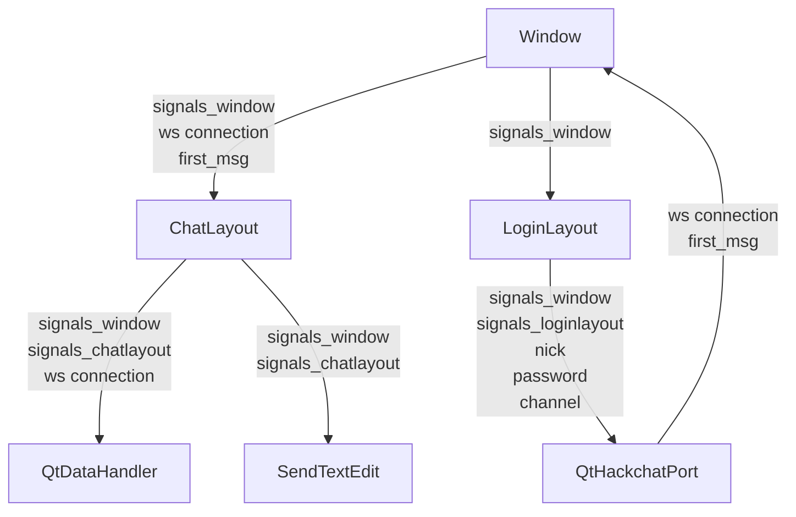
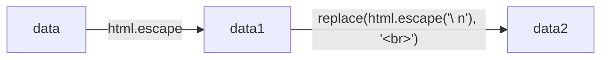
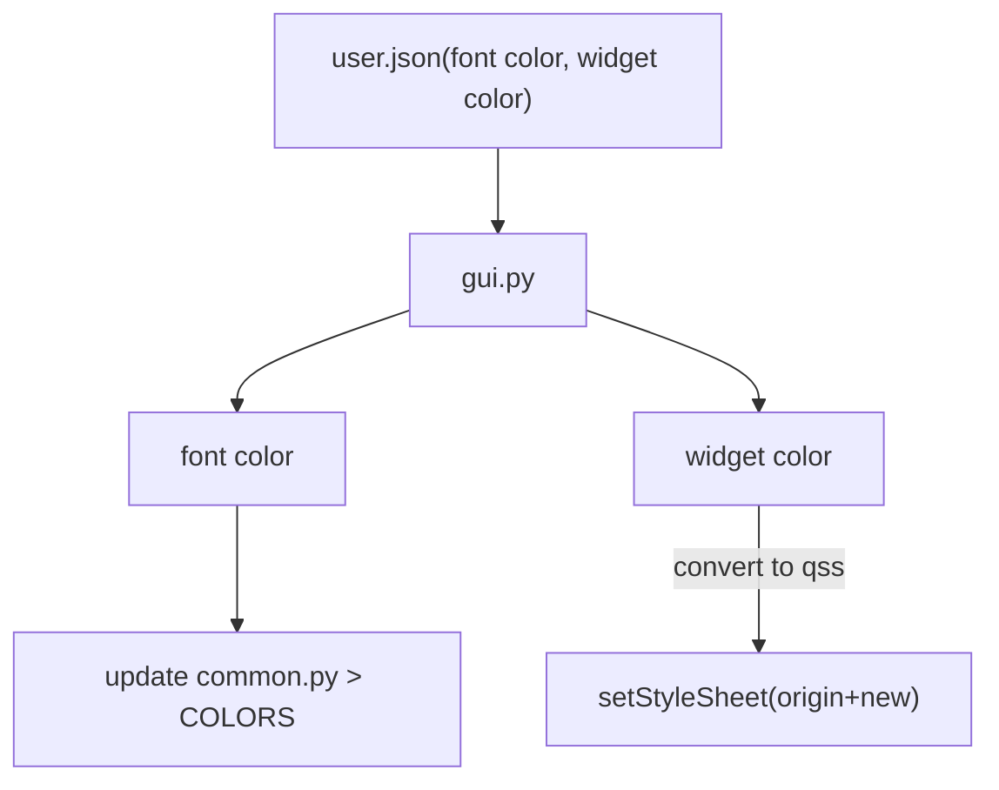

gui.py 程序结构

```mermaid
graph TD
    a[Window];
    b[LoginLayout];
    c[ChatLayout];
    d[QtHackchatPort];
    e[QtDataHandler];
    f[SendTextEdit];
    a --signals_window\nws connection\nfirst_msg--> c;
    b --"signals_window\nsignals_loginlayout\nnick\npassword\nchannel"--> d;
    a --signals_window--> b;
    d --ws connection\nfirst_msg--> a;
    c --signals_window\nsignals_chatlayout\nws connection--> e;
    c --signals_window\nsignals_chatlayout--> f;
```

处理收到的消息流程

```mermaid
graph LR
    a[data];
    b[data1];
    c[data2];
    a --html.escape--> b;
    b --> |"replace(html.escape('\ n'), '&ltbr&gt')"| c;
```

自定义颜色/主题方案

```mermaid
graph TD
    a["user.json(font color, widget color)"];
    b[gui.py];
    c[font color];
    d[widget color];
    e[update common.py > COLORS];
    f["setStyleSheet(origin+new)"];
    a --> b;
    b --> c;
    b --> d;
    c --> e;
    d --convert to qss--> f;
```